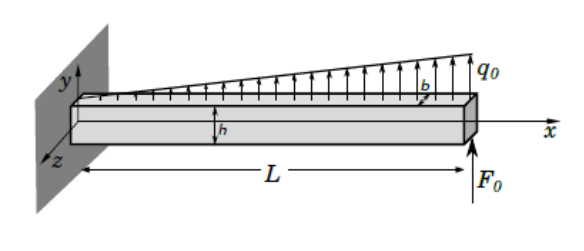
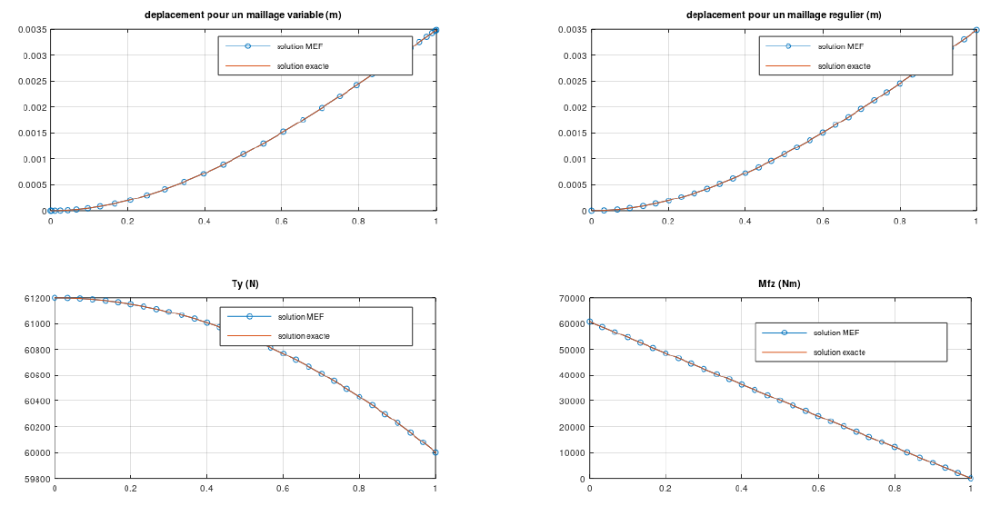

# Beam-Stress-Simulation-based-on-Finite-Elements-Method

Le but de ce TP est d’implémenter la méthode des éléments finis pour la résolution du cas d’une poutre soumise à la flexion sous la densité de force linéique q et d’une force ponctuelle localisée à son extrémité avec le langage de programmation Matlab.

On trace ensuite des courbes comparant le déplacements et les efforts théoriques à ceux trouvées par la méthode des éléments finis.

Voir le rapport pour plus de détails.

